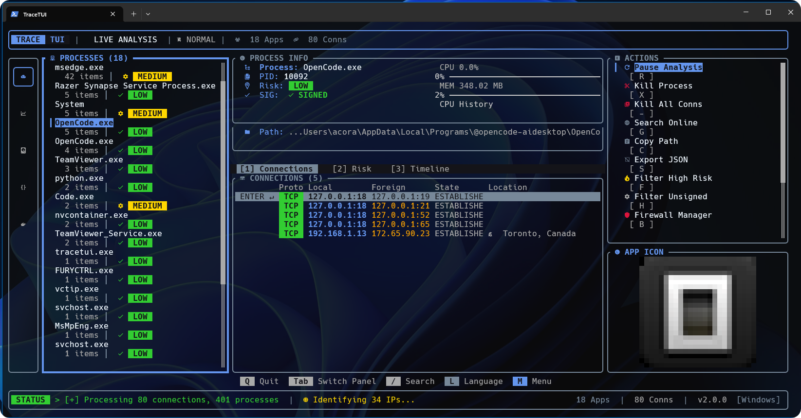
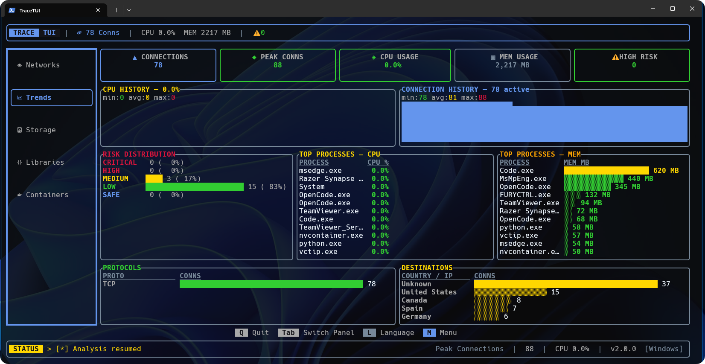
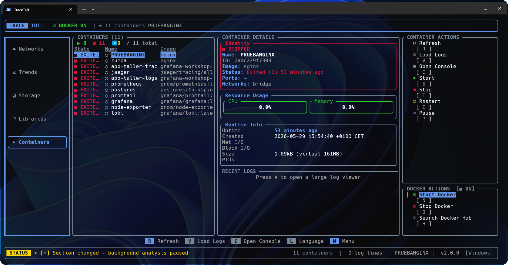
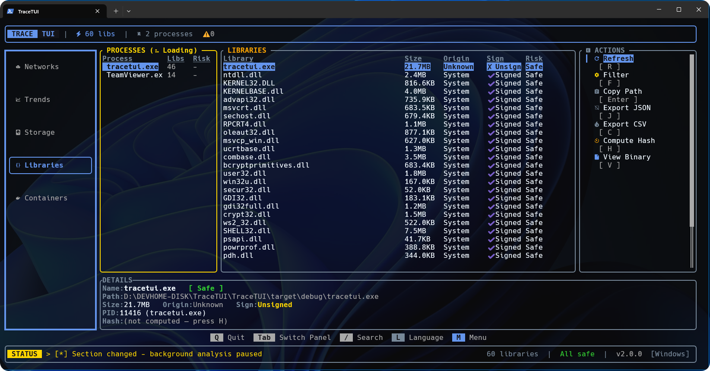
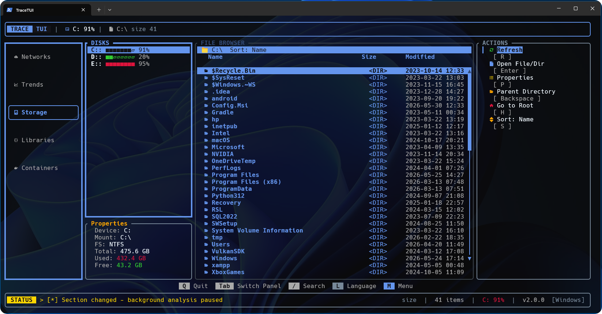

<div align="center">


# TraceTUI

**Terminal UI for System Process & Network Analysis**

[](https://github.com/AcoranGonzalezMoray/TraceTUI/actions)
[](https://www.rust-lang.org/)
[](https://github.com/AcoranGonzalezMoray/TraceTUI/releases)
[](https://acorangonzalezmoray.github.io/TraceTUI/)
[](LICENSE)
[](CONTRIBUTING.md)
[](#-installation)

[Features](#-key-features) •
[Installation](#-installation) •
[Quick Start](#-quick-start) •
[Architecture](#-architecture) •
[Contributing](#-contributing)

</div>

## 📖 Overview

**TraceTUI** is a terminal user interface (TUI) for system process and network analysis. Built with **Rust** and **Ratatui**, it provides real-time monitoring of network connections, process management, storage inspection, library analysis, and container orchestration — all from the terminal.



## ✨ Key Features

### 🕵️ Real-Time Network Monitoring
- **Connection Tracking**: Monitor active TCP/UDP connections with sub-second latency.
- **Filtering**: Exclude common ports (e.g., 80/443) to isolate unusual traffic.
- **Geo-Location**: Live IP location indicators (via ip-api.com) with batch lookup.
- **Search**: Filter through connections via live search (`/`).



### ⚙️ Process & Container Management
- **Process View**: Complete process visibility with executable paths and command-line arguments.
- **Resource Monitoring**: Track process-level CPU and memory usage in real time.
- **Container Integration**: Monitor Docker containers (CPU/Mem/Net I/O), view logs, and execute console commands from the UI.
- **Process Control**: Terminate processes or drop their network connections.

#### Container Actions
- Start, stop, restart, pause/unpause containers
- View container logs (tail 300 lines)
- Interactive shell console inside containers
- Docker Hub image search and container creation
- Start/stop Docker Desktop (Windows) or Docker daemon (Linux)




### 🔍 Investigation Suite
- **IP Analysis**: Geographic location, ISP, ASN, timezone, and connection type (mobile/hosting) for remote endpoints.
- **Network Diagnostics**: DNS resolution, WHOIS lookups, ping latency, and traceroute with geographic mapping.
- **Risk Scoring**: Automated evaluation based on domain/process mismatches, anonymity usage (VPN/Tor), and latency anomalies.

#### Library Inspection
- Loaded DLL/library listing per process with signature verification (Signed/Unsigned/Invalid)
- Origin classification: System, ProgramFiles, UserSpace, Temp
- Risk assessment with filterable columns
- Binary viewer with hex dump and x86 disassembly
- SHA-256 hash computation
- Export to JSON/CSV



#### Storage Explorer
- Disk usage visualization with usage bars (Windows and Linux)
- File browser with directory navigation (name/size/date sort)
- Recursive file search with extension filters (images, documents, code, archives, audio, video)
- Inline text/log/ANSI file viewer
- Image preview via PowerShell (Windows) or chafa/catimg (Linux)



### 🛡️ Firewall Management
- **Connection Blocking**: Select endpoints and block them via Windows Firewall.
- **Rules Review**: Browse blocked IPs and execute batch block/unblock operations.

### 💻 User Experience
- **Nerd Font Support**: Optional JetBrains Mono Nerd Font for enhanced icons.
- **Multi-language**: 9 built-in locales (EN, ES, FR, DE, IT, PT, JA, ZH, RU) — switch with `L` key.
- **Adaptive Layout**: Resizes to any terminal dimensions.

---

## 🌐 External Dependencies

TraceTUI connects to the following external services at runtime:

| Service | URL | Purpose |
|---|---|---|
| **ip-api.com** | `http://ip-api.com/json` | Geo-location of remote IP addresses (city, country, ISP, coordinates). |
| **ip-api.com (Batch)** | `http://ip-api.com/batch` | Bulk geoIP lookups for performance optimization in analysis. |
| **GitHub API** | `https://api.github.com/repos/...` | Startup version checker (verifies local against remote release). |
| **Google Search** | `https://www.google.com/search?q=` | Performs web queries via the "Search Online" feature. |
| **Nerd Fonts** | `https://github.com/ryanoasis/...` | Downloads the JetBrainsMono Nerd Font if the user chooses to install it. |
| **WHOIS** | Various Registries | Queries regional WHOIS registries for network block and domain insights. |

All URLs are centralized under `resources/external_urls.json` via compile-time loading.

---

## 🚀 Installation

TraceTUI requires **Rust 1.70+**. Administrator privileges are recommended for packet inspection and firewall features.

### 📥 Pre-built Binaries (Recommended)

Get the latest executable from the [Releases page](https://github.com/AcoranGonzalezMoray/TraceTUI/releases) or directly from the [Official Website](https://acorangonzalezmoray.github.io/TraceTUI/).
*(Note: TraceTUI contains a self-updating mechanism to check for newer versions on startup.)*

**Windows (PowerShell - Run as Administrator):**
```powershell
Invoke-WebRequest -Uri "https://github.com/AcoranGonzalezMoray/TraceTUI/releases/latest/download/tracetui-x86_64-pc-windows-gnu.zip" -OutFile "$env:TEMP\tracetui.zip"
Expand-Archive -Path "$env:TEMP\tracetui.zip" -DestinationPath "$env:TEMP\tracetui" -Force
& "$env:TEMP\tracetui\installOrUpdate.ps1"
```

**Linux:**
```bash
curl -L -o /tmp/tracetui.tar.gz "https://github.com/AcoranGonzalezMoray/TraceTUI/releases/latest/download/tracetui-x86_64-unknown-linux-gnu.tar.gz"
tar xzf /tmp/tracetui.tar.gz -C /tmp
chmod +x /tmp/installOrUpdate.sh
sudo sh /tmp/installOrUpdate.sh
```

### 🛠️ Build from Source
```bash
git clone https://github.com/AcoranGonzalezMoray/TraceTUI.git
cd TraceTUI
cargo build --release
./target/release/tracetui
```

---

## ⌨️ Quick Start

Navigate the TUI freely using the following core keybindings:

| Action | Shortcut |
| :--- | :--- |
| **Navigate Panels** | `Tab` / `Shift+Tab` |
| **Move Up / Down** | `↑` `↓` `PgUp` `PgDn` |
| **Deep Investigate** | `Enter` (on a connection/endpoint) |
| **Close / Exit View** | `Q` or `Esc` |
| **Search Bar** | `/` |
| **Toggle Nav Sidebar** | `M` |
| **Hunter Mode** | `H` |
| **Kill Process**| `X` |
| **Kill App Connections** | `-` |
| **Toggle Firewall Mode** | `B` |
| **Export to JSON** | `S` |
| **Language Modal** | `L` |

> *Tip: TraceTUI is fully capable of operating in the background. Press `H` to toggle "Hunter Mode" and filter out safe background processes.*

---

## 🏗️ Architecture

TraceTUI uses asynchronous systems to avoid blocking the UI rendering.

### 🗂️ Project Structure

```text
src/
├── main.rs                 # Entry point
├── app/
│   ├── mod.rs              # App struct (12 state fields), shared methods
│   ├── states/             # 12 state structs for different views
│   ├── services/           # Background polling, investigation, inputs
│   ├── ui/                 # UI render dispatch (Ratatui modules)
│   │   ├── mod.rs
│   │   ├── center_panel.rs # Connection, risk, timeline tabs
│   │   ├── sidebar_left.rs # Process list sidebar
│   │   ├── sidebar_right.rs# Actions sidebar
│   │   ├── nav_sidebar.rs  # Collapsible nav (Main/Trends/Storage/Libraries/Containers)
│   │   ├── header.rs       # Top status bar
│   │   ├── footer.rs       # Keybinding hint bar
│   │   ├── dialogs.rs      # Confirmation, search, language modals
│   │   ├── firewall.rs     # Firewall management view
│   │   ├── trends.rs       # Analytics dashboard (sparklines, KPIs, risk dist)
│   │   ├── storage.rs      # Disk and file browser
│   │   ├── libraries.rs    # Library inspection view
│   │   ├── containers.rs   # Container management view
│   │   ├── widgets.rs      # Shared UI components
│   │   └── theme.rs        # Color theme
│   ├── network/            # NetworkAnalyzer, connection parsing
│   ├── process/            # ProcessManager, ProcessInfo
│   ├── containers.rs       # Docker container manager
│   ├── storage.rs          # Disk/file system access
│   ├── libraries/          # Library inspection engine
│   ├── firewall_service.rs # Windows Firewall integration
│   ├── risk.rs             # Risk scoring logic
│   ├── investigation_service.rs
│   ├── grouping.rs         # Connection grouping
│   ├── installation.rs     # Install/update scripts
│   ├── nerdfont.rs         # Nerd Font installer
│   ├── io.rs               # Terminal setup/restore
│   └── types.rs            # Shared types
├── config/                 # Constants, thresholds, settings
├── i18n/                   # Translation engine (11 locales)
├── services/               # HTTP client, GeoIP service
└── utils/                  # DB, cache, formatting, WHOIS, rate limiter, icon extractor
test/
├── app/                    # Unit tests
└── E2E/                    # End-to-end integration tests
```

### 🧠 Key Design Decisions

- **Frontend**: [Ratatui](https://github.com/ratatui-org/ratatui) for ANSI rendering.
- **Concurrency**: [Tokio](https://tokio.rs/) for non-blocking geospatial queries and analysis.
- **State Storage**: [SQLite](https://www.sqlite.org/) for caching investigation data and firewall rules.
- **Safety**: Unit tests (`src/`) and E2E integration tests (`test/E2E/`).

---

## 🤝 Contributing

Contributions of any size — bug reports, feature requests, documentation, or code — are welcome!

1. Read our [Contributing Guidelines](CONTRIBUTING.md).
2. Fork the repository & create a feature branch.
3. Submit a Pull Request.

Make sure to run linting and tests before submitting:
```bash
cargo fmt && cargo clippy -- -D warnings 
cargo test
```

## 📜 License

Distributed under the MIT License. See [`LICENSE`](LICENSE) for more information.

---
<div align="center">
  <b>Built with 🦀 Rust</b><br>
  <a href="https://github.com/AcoranGonzalezMoray/TraceTUI/issues">Report a Bug</a> • <a href="https://github.com/AcoranGonzalezMoray/TraceTUI/issues">Request a Feature</a>
</div>
