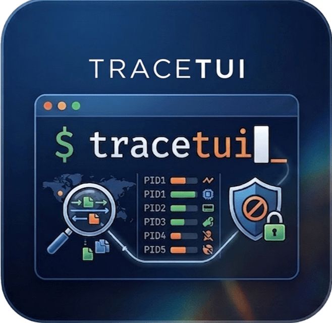
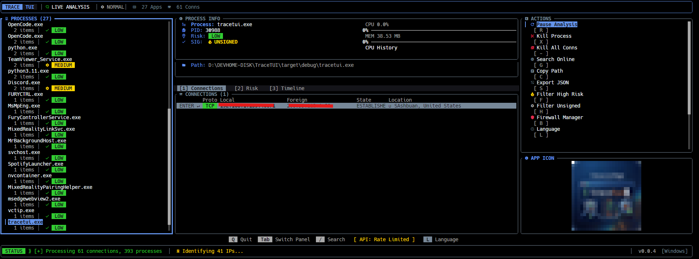

<div align="center">



# TraceTUI

### Modern Terminal Intelligence for Network & Process Investigation

[](https://www.rust-lang.org/)
[](LICENSE)
[](CONTRIBUTING.md)
[](#-installation)

</div>


## Overview

**TraceTUI** is a high-performance terminal user interface (TUI) for deep system forensic and network investigation. Built with **Rust** and **Ratatui**, it provides real-time monitoring of network traffic, process management, and suspicious activity analysis.




## Features

### Real-time Network Intelligence
- **Deep Monitoring**: Track active TCP/UDP connections with sub-second latency
- **Ports Filtering**: Exclude common ports (80/443) to focus on unusual traffic
- **Geo-Location**: Visual indicators for remote connection endpoints using ip-api.com
- **Batch GeoIP Lookup**: Efficient bulk IP lookups for improved performance
- **Sort & Search**: Navigate through hundreds of connections with live search (`/` key)
- **Filter High Risk**: Show only suspicious connections (`F` key)

### Advanced Process Management
- **System Enumeration**: Full process visibility including paths and command lines
- **Resource Tracking**: Real-time CPU and memory usage per process
- **Secure Termination**: Kill suspicious processes with multi-step confirmation (`X` key)
- **Connection Termination**: Kill all connections for a process (`-` key)
- **Window Integration**: (Windows only) Extract application icons and metadata
- **Clipboard Integration**: Copy process paths to clipboard (`Ctrl+C` or `C` key)
- **Online Search**: Search for process information online (`G` key)

### Deep Investigation Suite
- **IP Investigation**: Detailed analysis of remote IPs including:
  - Geographic location (city, country, coordinates)
  - ISP and organization details
  - ASN and network information
  - Timezone and connection type (mobile/proxy/hosting)
- **DNS Lookup**: Forward and reverse DNS resolution (`nslookup`/`dig`)
- **Network Diagnostics**: 
  - Ping latency measurement
  - Traceroute with geographic hop mapping
  - WHOIS record lookup
- **Risk Assessment**: Automated risk scoring based on:
  - Domain/process mismatch detection
  - Network anonymity indicators (proxy, VPN, Tor)
  - Latency anomalies
  - Hosting provider and mobile network detection
- **Visual Mapping**: Interactive map view of connection routes and endpoints

### Automated Batch Analysis
- **Risk Scoring**: Detect suspicious network patterns and orphaned processes
- **Heuristic Analysis**: Identify threats based on connection frequency and behavior
- **Filter Mode**: Auto-filter known-safe signed processes to surface unknowns (`H` key)
- **JSON Export**: Export full analysis to timestamped JSON files (`S` key or Action #5)
- **Pause/Resume**: Temporarily halt background analysis (`R` key)
- **Manual Refresh**: Trigger immediate analysis update (`Ctrl+R` key)

### Firewall Management
- **Per-Connection Blocking**: Select individual connections to block via Windows Firewall
- **Blocked IPs Viewer**: Review and unblock previously blocked addresses
- **Batch Operations**: Block/unblock multiple connections at once
- **Firewall Mode**: Toggle firewall management (`B` key or Action #7)

### User Experience
- **Full Input Support**: Comprehensive keyboard shortcuts and mouse interaction
- **Adaptive Layout**: Auto-scales panels based on terminal size
- **Multi-language**: Built-in i18n with 9 locales (EN, ES, FR, DE, IT, PT, JA, ZH, RU) (`L` key or Action #8)
- **Nerd Font Support**: Optional JetBrains Mono Nerd Font for enhanced iconography
- **System Tray**: Windows system tray integration for background operation
- **Update Checking**: Automatic version checks with GitHub releases
- **Installation Helpers**: Scripts for easy setup and dependency installation

### Investigation Panels
- **Connections View**: Detailed table of network connections with filtering
- **Risk Analysis**: Process risk scoring and threat indicators
- **Timeline View**: Historical activity tracking and trends
- **Map View**: Geographic visualization of connection routes
- **Process Details**: Executable paths, signatures, and resource usage
- **Firewall Management**: Connection blocking and IP allowlist/blocklist

---

## External Dependencies

TraceTUI connects to the following external services at runtime:

| Service | URL | Purpose |
|---|---|---|
| **ip-api.com** | `http://ip-api.com/json` | Geo-location of remote IP addresses (city, country, ISP, coordinates). Used in the investigation panel and connection location column. |
| **ip-api.com (Batch)** | `http://ip-api.com/batch` | Bulk geoIP lookups for improved performance during analysis. |
| **GitHub API** | `https://api.github.com/repos/.../releases/latest` | Version check — compares local version against latest remote release at startup. |
| **GitHub Releases** | `https://github.com/.../releases/latest` | Opens the download page when the user accepts an update from the update dialog. |
| **Google Search** | `https://www.google.com/search?q=` | Opens a web search for the selected process name via the "Search Online" action. |
| **Nerd Fonts** | `https://github.com/ryanoasis/nerd-fonts/releases/.../JetBrainsMono.zip` | Downloads JetBrainsMono Nerd Font when the user opts to install it from the Nerd Font dialog. |
| **WHOIS Services** | Various | Queries regional WHOIS registries for domain and IP registration information. |

All URLs are centralized in [`resources/external_urls.json`](resources/external_urls.json) and loaded at compile time via `include_str!`.

---

## Installation

### Prerequisites
- **Rust Toolchain** (v1.70+): [Install Rust](https://rustup.rs/)
- **Administrator Privileges**: Recommended for firewall operations and process termination
- **Nerd Font**: Recommended for optimal icon display (JetBrains Mono Nerd Font)

### From Release Binaries

Pre-built binaries are available on the [Releases page](https://github.com/AcoranGonzalezMoray/TraceTUI/releases).

> **Already installed?** Just run `tracetui` — it checks for updates automatically on every launch.
> The install script below is only needed for first-time setup.

**Windows:**
1. Download `tracetui-x86_64-pc-windows-gnu.zip`
2. Extract and run `installOrUpdate.ps1` (adds `tracetui` to your user PATH)
3. Restart your terminal and run `tracetui`

**Linux:**
1. Download `tracetui-x86_64-unknown-linux-gnu.tar.gz`
2. Extract: `tar xzf tracetui-x86_64-unknown-linux-gnu.tar.gz`
3. Run the install script: `chmod +x installOrUpdate.sh and next sudo sh ./installOrUpdate.sh`
4. Run `tracetui`

### From Source

```bash
git clone https://github.com/AcoranGonzalezMoray/TraceTUI.git
cd TraceTUI
cargo build --release
./target/release/tracetui
```

---

## Quick Start

| Action | Key / Input |
| :--- | :--- |
| Navigate panels | `Tab` / `BackTab` |
| Select app / action | `Up` `Down` |
| Confirm / enter | `Enter` |
| Search | `/` then type query |
| Toggle filter (high risk) | `F` |
| Toggle hunter mode | `H` |
| Pause / resume analysis | `R` |
| Manual batch refresh | `Ctrl+R` |
| Export to JSON | `S` or Action panel #5 |
| Firewall mode | `B` or Action panel #7 |
| Show language modal | `L` or Action panel #8 |
| Nerd font dialog | Action panel #9 |
| Center tab: Connections | `1` |
| Center tab: Risk | `2` *(requires selected app)* |
| Center tab: Timeline | `3` |
| Toggle map view | Action panel #0 *(during investigation)* |
| Kill selected process | `X` or Action panel #1 |
| Kill all connections | `-` or Action panel #2 |
| Search online | `G` or Action panel #3 |
| Copy process path | `Ctrl+C` or `C` or Action panel #4 |
| Toggle filter | `F` or Action panel #6 |
| Quit | `Q` or `Esc` |

---

## Rust Commands

```bash
# Build
cargo build              # Debug build
cargo build --release    # Release build

# Run
cargo run                # Run in debug mode

cargo test               # Run all tests

# Lint
cargo fmt                # Format code
cargo clippy             # Lint with clippy
```

---

## Architecture

### Project Structure

```
resources/
└── external_urls.json      # Centralized external API URLs (loaded at compile time)
scripts/
├── installOrUpdate.ps1     # Windows first-time install script
├── installOrUpdate.sh      # Linux first-time install script
├── tracetui.desktop        # Linux desktop entry
└── icon_extractor.ps1      # Windows icon extraction helper
src/
├── main.rs                 # Entry point
├── app/
│   ├── mod.rs              # App struct, state, core logic
│   ├── analysis.rs         # Auto-analysis, geo lookup, investigation
│   ├── firewall_service.rs # Firewall panel state machine
│   ├── grouping.rs         # ConnectionGrouper: process→connection→risk
│   ├── input.rs            # Key/mouse event dispatch, actions
│   ├── installation.rs     # Net-tools installation helpers
│   ├── investigation_service.rs  # Deep-dive IP investigation
│   ├── io.rs               # Terminal setup/restore
│   ├── nerdfont.rs         # Nerd Font detection
│   ├── risk.rs             # RiskAnalyzer: scoring engine
│   ├── types.rs            # Core enums, structs, traits
│   ├── network/
│   │   ├── mod.rs          # NetworkAnalyzer, connection parsing
│   ├── process/
│   │   ├── mod.rs          # ProcessManager, ProcessInfo
│   └── ui/
│       ├── mod.rs          # UI render dispatch
│       ├── center_panel.rs
│       ├── dialogs.rs
│       ├── firewall.rs
│       ├── footer.rs
│       ├── header.rs
│       ├── sidebar_left.rs
│       ├── sidebar_right.rs
│       ├── theme.rs        # Glassmorphic theme
│       └── widgets.rs      # Custom widgets (scrollbar, etc.)
├── resources.rs            # Centralized external URLs (Lazy<ExternalUrls>)
├── config/
│   └── mod.rs              # Constants, thresholds, settings
├── i18n/
│   ├── mod.rs              # Locale detection
│   └── translator.rs       # i18n engine with locale files
├── services/
│   ├── mod.rs
│   ├── api_client.rs       # HTTP client for external APIs
│   └── geoip_service.rs    # GeoIP lookup (private IP skip, flag emoji)
├── utils/
│   ├── mod.rs
│   ├── api_builder.rs      # URL builder for API requests
│   ├── db.rs               # SQLite database (blocks, investigations)
│   ├── formatting.rs       # Byte size, memory formatting
│   ├── icon_extractor.rs   # Icon cache with LRU eviction
│   ├── rate_limiter.rs     # Token-bucket rate limiter
│   ├── signatures.rs       # SignatureStatus, SignatureVerifier
│   └── whois.rs            # WHOIS data cleaner
test/
├── mod.rs                  # Test bridge with #[path] attributes
├── mainShould.rs
├── app/                    # Unit tests mirroring src/app/
├── config/
├── i18n/
├── resources/              # Tests for external URL constants
├── services/
├── utils/
└── E2E/                    # End-to-end integration tests
    ├── analysis_lifecycleShould.rs
    ├── firewall_flowShould.rs
    └── export_and_investigationShould.rs
```

### Key Design Decisions

- **TUI Layer**: [Ratatui](https://github.com/ratatui-org/ratatui) for terminal rendering
- **Async Core**: [Tokio](https://tokio.rs/) for background geo-lookup and investigation tasks
- **State Store**: [SQLite](https://www.sqlite.org/) via `rusqlite` for blocked IPs and investigations
- **Separation of Concerns**: System polling runs on `std::thread`; UI updates on main thread
- **Test Structure**: Every `src/` file has a corresponding `test/` file with `#[path]` bridge
- **Modular Design**: Separate modules for network, process, analysis, UI, and utilities
- **Error Handling**: Comprehensive error propagation using `anyhow` and `thiserror`
- **Internationalization**: Built-in translation system with JSON locale files
- **Performance**: LRU caching for icons, rate limiting for API calls, efficient data structures

---

## Contributing

We welcome contributions! Please read our [Contributing Guidelines](CONTRIBUTING.md) and [Code of Conduct](CODE_OF_CONDUCT.md).

### Development Setup

```bash
# Clone and build
git clone https://github.com/AcoranGonzalezMoray/TraceTUI.git
cd TraceTUI
cargo build

# Run tests before submitting PR
cargo test

# Format and lint
cargo fmt && cargo clippy
```

---

## License

This project is licensed under the **MIT License**. See [LICENSE](LICENSE) for details.

---

## Acknowledgments

Built with [Ratatui](https://github.com/ratatui-org/ratatui) and [Tokio](https://tokio.rs/)

[Report Bug](https://github.com/AcoranGonzalezMoray/TraceTUI/issues) • [Request Feature](https://github.com/AcoranGonzalezMoray/TraceTUI/issues)
